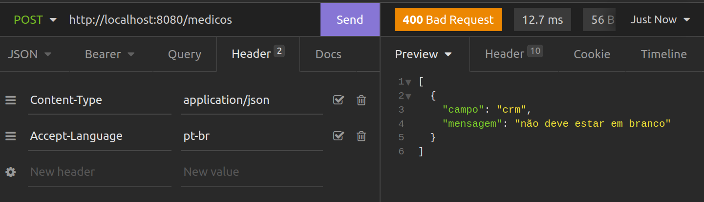

## Para saber mais: mensagens em português

Por padrão o Bean Validation devolve as mensagens de erro em inglês, entretanto existe uma tradução dessas mensagens para o português já implementada nessa especificação.

No protocolo HTTP existe um cabeçalho chamado **Accept-Language**, que serve para indicar ao servidor o idioma de preferência do cliente disparando a requisição. Podemos utilizar esse cabeçalho para indicar ao Spring o idioma desejado, para que então na integração com o Bean Validation ele busque as mensagens de acordo com o idioma indicado.

No Insomnia, e também nas outras ferramentas similares, existe uma opção chamada **Header** que podemos incluir cabeçalhos a serem enviados na requisição. Se adicionarmos o header **Accept-Language** com o valor **pt-br**, as mensagens de erro do Bean Validation serão automaticamente devolvidas em português.

Aba Header no Isomnia contendo os cabeçalhos da requisição, incluindo o cabeçalho **Accept-Language**

Obs: O Bean Validation tem tradução das mensagens de erro apenas para alguns poucos idiomas.
