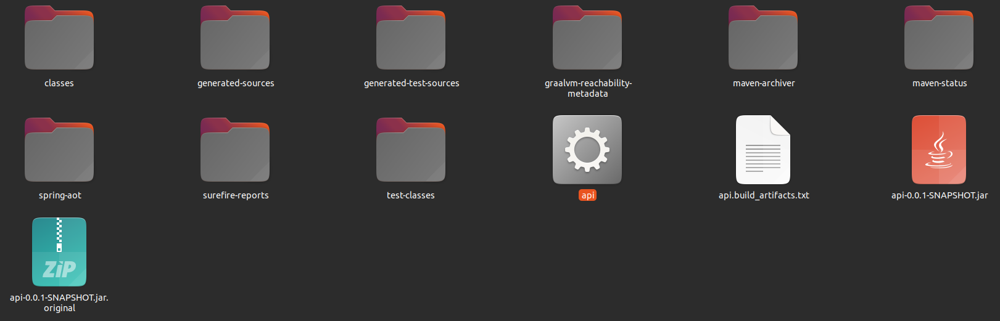

## Para saber mais: GraalVM Native Image

Uma das novidades de mais destaque da versão 3 do Spring Boot é o suporte a imagens nativas, algo que reduz, de maneira muito significativa, o consumo de memória e o tempo de inicialização de uma aplicação, sendo que alguns outros frameworks concorrentes do Spring Boot, como Micronaut e Quarkus, já forneciam suporte a esse recurso.

Na realidade até era possível gerar imagens nativas em aplicações com Spring Boot antes da versão 3, mas para isso se fazia necessário a utilização de um projeto chamado **Spring Native**, que adicionava suporte a isso. Com a chegada da versão 3 do Spring Boot, tal projeto não é mais necessário.

-----
### Native Image

Imagem nativa é uma tecnologia utilizada para compilar uma aplicação Java, incluindo todas as suas dependências, gerando um arquivo binário executável que pode ser executado diretamente no sistema operacional, sem a necessidade de se utilizar a JVM. Mesmo sem executar numa JVM, a aplicação também contará com os recursos dela, como gerenciamento de memória, garbage collector e controle de execução de threads.

Para saber mais detalhes sobre a tecnologia de imagens nativas acesse a documentação no site: https://www.graalvm.org/native-image

-----
### Native Imagem com Spring Boot 3

Uma maneira bem simples de gerar uma imagem nativa da aplicação é utilizando um plugin do Maven, que deve ser incluído no arquivo `pom.xml`:

```xml
<plugin>
  <groupId>org.graalvm.buildtools</groupId>
  <artifactId>native-maven-plugin</artifactId>
</plugin>
```

Pronto! Essa é a única alteração necessária no projeto. Após isso, a geração da imagem deve ser feita via terminal, com o seguinte comando Maven sendo executado no diretório raiz do projeto:

```bash
./mvnw -Pnative native:compile
```

O comando anterior pode levar vários minutos para finalizar sua execução, sendo totalmente normal essa demora.

Atenção! Para executar o comando anterior e gerar a imagem nativa do projeto, é necessário que você tenha instalado em seu computador o [GraalVM](https://www.graalvm.org/) (máquina virtual Java com suporte ao recurso de Native Image) em uma versão igual ou superior a 22.3.

Após o comando anterior finalizar, será gerado no terminal um log como o seguinte:

```bash
Top 10 packages in code area:           Top 10 object types in image heap:
3,32MB jdk.proxy4                      19,44MB byte[] for embedded resources
1,70MB sun.security.ssl                16,01MB byte[] for code metadata
1,18MB java.util                        8,91MB java.lang.Class
936,28KB java.lang.invoke                 6,74MB java.lang.String
794,65KB com.mysql.cj.jdbc                6,51MB byte[] for java.lang.String
724,02KB com.sun.crypto.provider          4,89MB byte[] for general heap data
650,46KB org.hibernate.dialect            3,07MB c.o.s.c.h.DynamicHubCompanion
566,00KB org.hibernate.dialect.function   2,40MB byte[] for reflection metadata
563,59KB com.oracle.svm.core.code         1,30MB java.lang.String[]
544,48KB org.apache.catalina.core         1,25MB c.o.s.c.h.DynamicHu~onMetadata
61,46MB for 1482 more packages           9,74MB for 6281 more object types
--------------------------------------------------------------------------------
    9,7s (5,7% of total time) in 77 GCs | Peak RSS: 8,03GB | CPU load: 7,27
--------------------------------------------------------------------------------
Produced artifacts:
/home/rodrigo/Desktop/api/target/api (executable)
/home/rodrigo/Desktop/api/target/api.build_artifacts.txt (txt)
================================================================================
Finished generating 'api' in 2m 50s.
[INFO] ------------------------------------------------------------------------
[INFO] BUILD SUCCESS
[INFO] ------------------------------------------------------------------------
[INFO] Total time:  03:03 min
[INFO] Finished at: 2023-01-17T12:13:04-03:00
[INFO] ------------------------------------------------------------------------
```

A imagem nativa é gerada no diretório **target**, juntamente com o arquivo .jar da aplicação, como um arquivo executável de nome **api**, conforme demonstrado na imagem a seguir:



Diferente do arquivo .jar, que é executado pela JVM via comando `java -jar`, a imagem nativa é um arquivo binário e deve ser executada diretamente pelo terminal:

```bash
target/api
```

Ao rodar o comando anterior será gerado o log de inicialização da aplicação, que ao final exibe o tempo que levou para a aplicação inicializar:

```bash
INFO 127815 --- [restartedMain] med.voll.api.ApiApplication : Started ApiApplication in 0.3 seconds (process running for 0.304)
```

Repare que a aplicação levou menos de meio segundo para inicializar, algo realmente impressionante, pois quando a executamos pela JVM, via arquivo .jar, esse tempo sobe para algo em torno de 5 segundos.

Para saber mais detalhes sobre a geração de uma imagem nativa com Spring Boot 3 acesse a documentação no site:

- [GraalVM Native Image Support](https://docs.spring.io/spring-boot/docs/current/reference/html/native-image.html)
