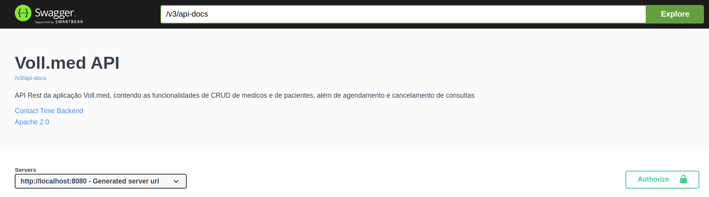

## Para saber mais: personalizando a documentação

Vimos no vídeo anterior que é possível personalizar a documentação gerada pelo SpringDoc para a inclusão do token de autenticação. Além do token, podemos incluir outras informações na documentação que fazem parte da especificação OpenAPI, como, por exemplo, a descrição da API, informações de contato e de sua licença de uso.

Tais configurações devem ser feitas no objeto `OpenAPI`, que foi configurado na classe `SpringDocConfigurations` de nosso projeto:

```java
@Bean
public OpenAPI customOpenAPI() {
    return new OpenAPI()
        .components(new Components()
            .addSecuritySchemes("bearer-key",
                new SecurityScheme()
                    .type(SecurityScheme.Type.HTTP)
                    .scheme("bearer")
                    .bearerFormat("JWT")))
        .info(new Info()
            .title("Voll.med API")
            .description("API Rest da aplicação Voll.med, contendo as funcionalidades de CRUD de médicos e de pacientes, além de agendamento e cancelamento de consultas")
            .contact(new Contact()
                .name("Time Backend")
                .email("backend@voll.med"))
        .license(new License()
            .name("Apache 2.0")
            .url("http://voll.med/api/licenca")));
}
```

No código anterior, repare que após a configuração do token JWT foram adicionadas as informações da API. Ao entrar novamente na página do Swagger UI, tais informações serão exibidas, conforme demonstrado na imagem a seguir:




Para saber mais detalhes sobre quais informações podem ser configuradas na documentação da API, consulte a [especificação OpenAPI](https://spec.openapis.org/oas/latest.html#schema) no site oficial da iniciativa.